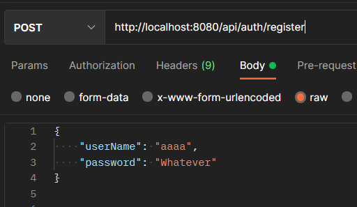
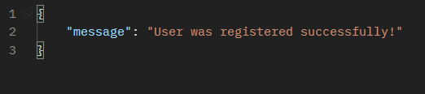
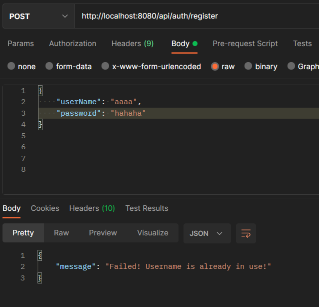
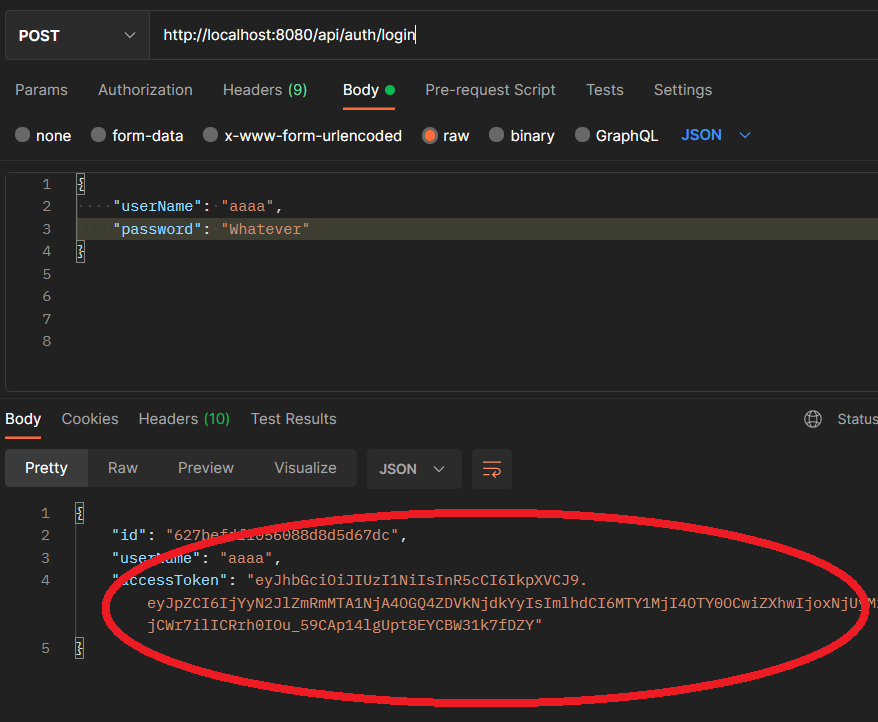
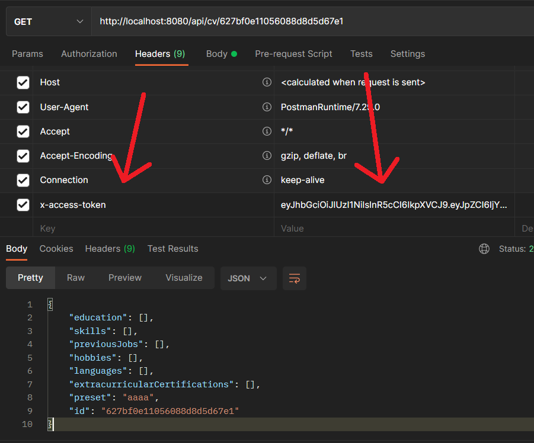
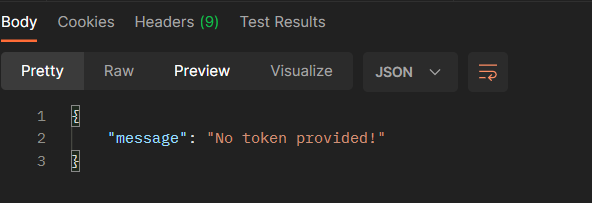

These commands need to be run from inside of the "backend" folder.


# Pre requisites 

Before running the project, create a .env file in the backend folder and add inside the following line for configurating the database :

```
ORIGIN_CORS_OPTIONS="http://localhost:8081"
DB_URL="mongodb://localhost:27017/info_db"
```

In order to enable authentication, we need to add a secret key, and add xthe time (in hours) that the tokens will be valid. 
Write those informations in the file with these lines:

```
JWT_SECRET="put_your_key_here"
TOKEN_VALIDITY_TIME= 2
```
Feel free to modify them to change the settings.

# To get the project setup:
```
npm install
```

# To run the server, execute the following line:
```
node server.js
```

# API Documentation (examples)

## Authentification 

1- Registration.



When username already exists, the registration fails:



2- Loging in : Success and fail.




3- After loging, the access token we receive needs to be sent back with each request as a header. 
Failing to provide it will make the server return a message for no token provided.





 ## Appels (avec exemples)

 1- Create a document 
 
 

 Result:
 
 

  2- Delete a document 
 
 

 Result:

 

(type_bloc dans Education,Skill,Job,Language,Certification)

POST + ./api/cv/{id}/{type_bloc} : Ajouter valeur au CV

GET + ./api/cv/{id}/{type_bloc} : Afficher valeurs de ce type pour le CV {id}

DELETE + ./api/cv/{id}/{type_bloc}/{id} : Supprimer valeur en particulier

DELETE + ./api/cv/{id}/{type_bloc} : Supprimer toutes les valeurs pour ce bloc dans le CV {id}


POST + ./api/cv/ : Créer  CV (discuter des champs obligatoires - pour le moment c'est preset)
GET + ./api/cv/{id} : Récupérer  CV (a discuter si on le recupere juste avec les références où tous les éléments )

POST + ./api/cv/{id}/hobby : Ajouter liste entière hobbies au  CV / Ecraser l'ancienne
POST + ./api/cv/{id}/jobtitle : Ajouter nouveau titre au  CV / Ecraser l'ancien

DELETE + ./api/cv/{id}/: Supprimer un CV en particulier