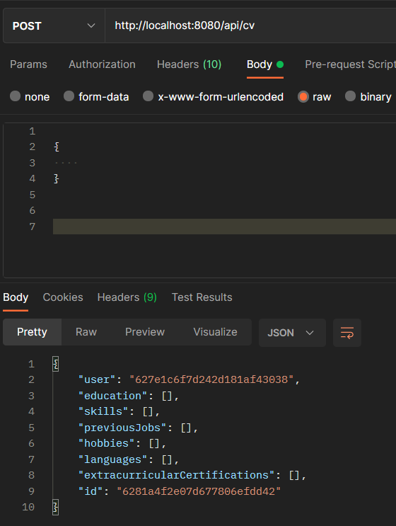
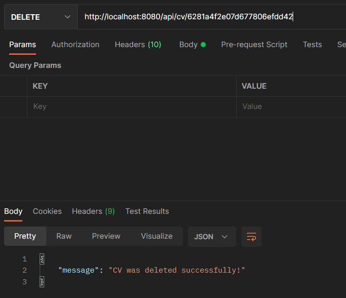

# Pre requisites 

Before running the project, create a .env file in the backend folder and add inside the following lines :

```
ORIGIN_CORS_OPTIONS=http://localhost:3000

DB_URL="mongodb://localhost:27017/info_db"

JWT_SECRET="my_secret_key"

TOKEN_VALIDITY_TIME= 2
```

You can change them in order to fit your project's settings. The TOKEN_VALIDITY_TIME is the amount of time (in hours) that the tokens (given during authentication) will be valid.


# To install the project setup:
```
npm install
```

# To run the server

Execute the following line (from inside the backend folder):
```
node server.js
```

# API Documentation (examples)

For more information, you can check an object's model (under the **models** folder) to know its fields. 
Inside the **routes** folder, you can find all the types of requests possible (and the urls).
In this next part, a few examples will be given, as well as a guide on how to get started.

In order to create a CV, no field is mandatory. For the other objects (Education, Skill, Job, Language, Certification), there is at least one field mandatory. Attempting to create one without that field will result in an error. 

## Authentification 

### 1- Registration.  


### 2- Loging in  


The response contains an access token that needs to be added to the headers under an **x-access-token** property. It needs to be sent with every request.

### 3- A simple request


 
 ## General structure of API calls
 
 ### Main CV information and special blocs

For special_bloc in education, skill, job, language,and certification, we have:
```
POST + ./api/cv/ : Create a CV   
POST + ./api/cv/{cv_id}/{special_bloc} : Add a new bloc to the CV of id={cv_id}  
POST + ./api/cv/{cv_id}/phonenumber : Change the phone number  
POST + ./api/cv/{cv_id}/emailadress : Change the email adress  
POST + ./api/cv/{cv_id}/homeadress : Change the home adress  
POST + ./api/cv/{cv_id}/drivinglicence : Change the type of licence  
POST + ./api/cv/{cv_id}/hobby : Change the list of hobbies  
POST + ./api/cv/{cv_id}/jobtitle : Change the title of the CV  
POST + ./api/cv/{cv_id}/fullname : Change the name written for the CV owner  

GET + ./api/cv/ : Get all CVs of the active user  
GET + ./api/cv/{id} : Get the CV of id={cv_id} and all its components  
GET + ./api/cv/{cv_id}/{special_bloc} : Get all of the values for that speficic type of bloc inside the CV of id={cv_id} (Exemple: Get all certifications for one particular CV)  

DELETE + ./api/cv/: Delete all CVs of the active user  
DELETE + ./api/cv/{id}/: Delete the CV of id={cv_id}  
DELETE + ./api/cv/{cv_id}/{special_bloc}/{bloc_id} : Delete one special bloc in particular  
DELETE + ./api/cv/{cv_id}/{special_bloc} : Delete all values for one type of bloc inside CV of id={cv_id}  
```

### Authentification and user routes
```
POST + ./api/auth/register : Create an account  
POST + ./api/auth/login : Logging in  
POST + ./api/auth/test : Verify the token  
POST + ./api/user/password : Change the password  

GET + ./api/user : Get user information  
```

## API Calls (examples)

It is assumed here that the user is already logged in and provides tokens with each request.

### 1- Creating a CV 



### 2- Adding one element to that CV (Education)


### 3- Deleting the CV 

