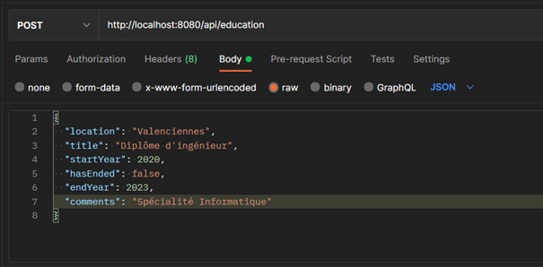
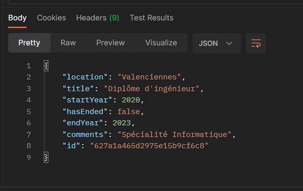
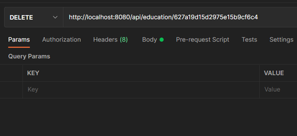
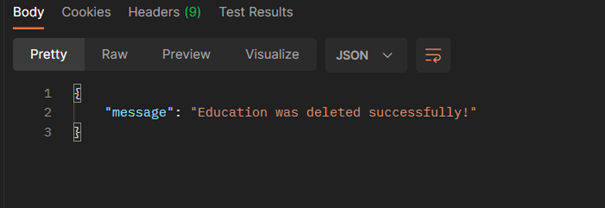

These commands need to be run from inside of the "backend" folder.


# Pre requisites 

Before running the project, create a .env file in the backend folder and add inside the following line :

```
DB_URL="mongodb://localhost:27017/info_db"
```

# To get the project setup:
```
npm install
```

# To run the server, execute the following line:
```
node server.js
```

# API Documentation (examples)
 1- Create a document 
 
 

 Result:
 
 

  2- Delete a document 
 
 

 Result:

 